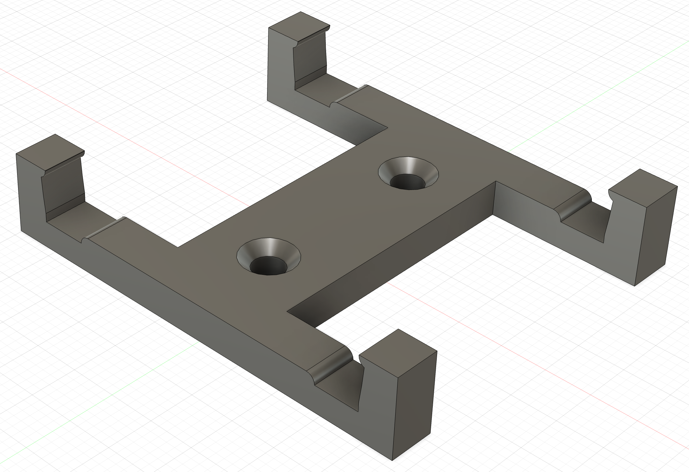

# bodnar-gpsdo-mount

Simple 3D Printable Mount for the Leo Bodnar "Mini Precision GPS Reference Clock".

I designed this for simple mounting of the GPSDO inside project enclosures. It is probably not suitable for high-vibration environments.

The mounting holes are for M3 flat head socket screws, or similar.

This was optimized for PETG printing on an Ender 3 V2, and may need minor adjustments for your printer.

James Morris, W7TXT 
https://w7txt.net/

