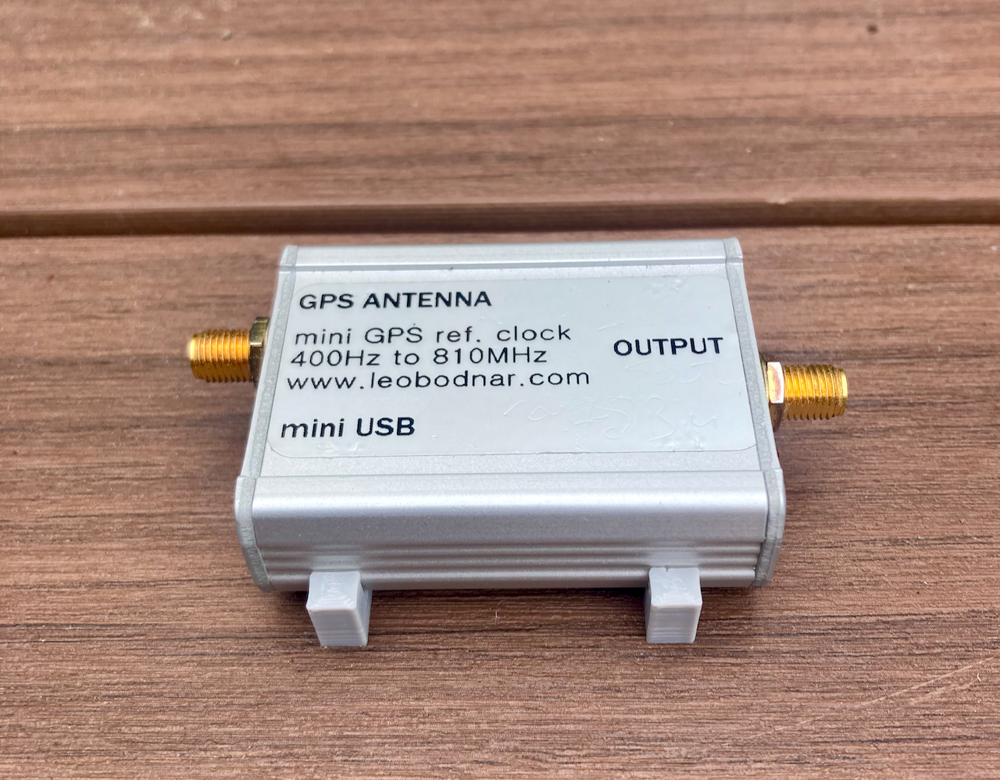

# Simple 3D Printable Mount for the Leo Bodnar Mini Precision GPS Reference Clock

  

  I designed this for simple mounting of the GPSDO inside project enclosures.
The mounting holes are for M3 flat head socket screws, or similar. This was optimized for PETG printing on an Ender 3 V2, and may need minor adjustments for your printer.

The mount in action:

  

Enjoy!

James Morris, W7TXT 
https://w7txt.net/

